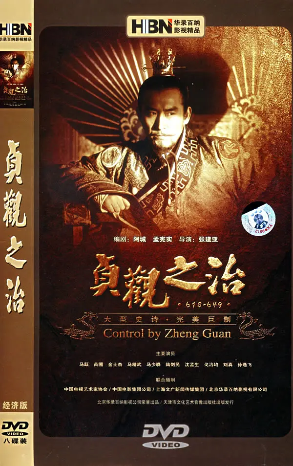

## 贞观之治 

贞观之治是[唐朝](https://baike.baidu.com/item/唐朝/53699)初年唐太宗[李世民](https://baike.baidu.com/item/李世民/44058)在位期间出现的政治清明、经济复苏、文化繁荣的[治世](https://baike.baidu.com/item/治世/570009)局面。

因其时年号为“[贞观](https://baike.baidu.com/item/贞观/3695091)”（627年－649年） ，故史称“贞观之治”。

## 影视资源

阿里云盘分享：

[https://www.aliyundrive.com/s/BBJWLbNuwvq](https://www.aliyundrive.com/s/BBJWLbNuwvq)

哔哩哔哩 up主讲解视频：

[https://space.bilibili.com/44218642/channel/collectiondetail?sid=331566](https://space.bilibili.com/44218642/channel/collectiondetail?sid=331566)

> 嫌弃时间长可以观看up精简讲解的视频